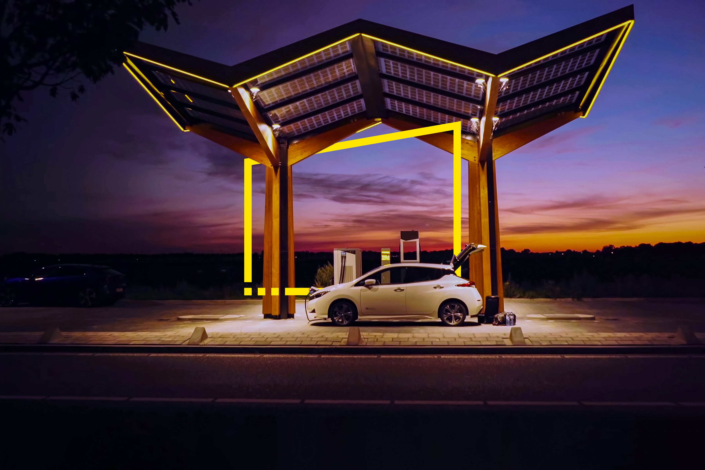

# Forecasting-EV-Charging-Station-Load

This work was carried out as the part of the Overall Multidisciplinary Project in Ense3 from September 2022 to January 2023.\
 
Team:\
Oscar Wahlström\
Camille Fournier\
Yann Le Floch\
Anujraaj Gopalsamy Sakthivel

Supervisors:\
Manar Amayri\
Nana Kofi Baabu Twum Duah\

 The use of Renewable Energy Resources is increasing rapidly to meet the objectives of the energy transition, alongside the development of electric mobility with low-carbon electricity as a solution to reduce greenhouse gas emissions. However, the growth of electric vehicles (EVs) creates new constraints on the power grid, as the demand for electricity increases to charge these vehicles. According to RTE, by 2035, EVs will consume approximately 8% of France's total electricity production. Despite this, the increase in EVs also provides new flexibility opportunities for the grid, such as real-time load balancing and bidirectional charging with self-consumption of photovoltaic (PV) energy.
  
  This paper analyzes the time series of an EV charging station located on the premises of the GreEn-ER building, which houses Grenoble-INP ENSE3. The main objective of this work is to build a predictive model for a Model Predictive Control (MPC) application using Python programming language. To achieve this, the work done by a previous group on the development of a predictive model for an MPC to increase the self-consumption of the Predis MHI platform was studied. The EV data from the station was analyzed and preprocessed, including removing outliers and normalization. A selection of promising models tested by the previous group was then tested on the EV data set, including Long Short-Term Memory networks (LSTM) and Convolutional Neural Network (CNN)-LSTM models. The CNN-LSTM model showed better performance and was kept to see if additional features could increase its performance. Finally, clustering was also studied and showed promising results.

